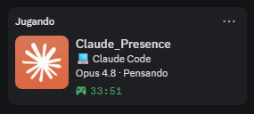

# claude-rich-presence

Discord **Rich Presence** propia para la **app de escritorio de Claude** (Windows).
Muestra en tu perfil de Discord qué estás haciendo en Claude: el **producto**
(Code / Cowork / Design / Chat), el **proyecto o repo**, el **modelo**, la
**actividad** y el **tiempo de sesión** — todo leyendo tus propios logs locales,
sin tocar credenciales ni la red.



```
Jugando a Claude_Rich_Presence
  💻 claude-rich-presence        ← producto · proyecto/repo
  Opus 4.8 · Generando…          ← modelo · actividad
  12:34 transcurrido
```

## Qué detecta

Distingue los cuatro productos de Claude, cada uno con su emoji (configurable):

| Producto | Emoji | Qué muestra |
|---|---|---|
| **Claude Code** (local · nube · ssh) | 💻 | la carpeta local o el repo; si la nube no lo registra, "Claude Code" |
| **Claude Cowork** | 👥 | "Cowork" |
| **Claude Design** | 🎨 | el nombre del archivo de diseño |
| **Claude Chat** | 💬 | "En una conversación" |

Además: **modelo** (Opus 4.8 / Sonnet 4.6 / Haiku 4.5…), **actividad**
(Generando / Pensando) y **tiempo de sesión**.

## Cómo funciona

Claude Desktop no expone una API de "qué estoy haciendo", así que el demonio
**observa tus logs locales** en `%APPDATA%\Claude\` (solo lectura):

- **Producto activo** → la ruta de la UI en `main.log`
  (`topFrameUrl: https://claude.ai/<ruta>`): `design/p`, `cowork/`,
  `local_sessions/`, `chat`/`new`.
- **Sesión de código y su carpeta** → `setFocusedSession` (local_ = local,
  session_ = nube) + `addFolderToSession` / `cwd=` / `repo=`.
- **Modelo** → líneas `model: claude-…` de `main.log`.
- **Actividad** → heurística por eventos de generación.
- **App abierta/enfocada** → proceso y ventana (PowerShell).

Nunca lee credenciales (`oauth:tokenCache`, cookies), ni intercepta red, ni
modifica Claude.

## Requisitos

- **Windows** + **Node.js 20+**.
- **Discord de escritorio** abierto (la Rich Presence va por IPC local; no
  funciona desde el navegador).
- En Discord: **Ajustes → Privacidad de actividad → "Compartir tu actividad
  detectada"** activado.

## Configuración

1. Crea una aplicación en el **Discord Developer Portal**
   (https://discord.com/developers/applications). El nombre es lo que se verá
   como "Jugando a ___".
   > ⚠️ Discord **filtra "Claude"** (marca registrada): rechaza `Claude` y
   > `Claude AI`. Lo que **sí** funciona es añadir guiones bajos, p. ej.
   > **`Claude_Rich_Presence`**.
2. Copia su **Application ID**.
3. (Opcional) En **Rich Presence → Art Assets** sube un icono con la clave
   `claude_icon` (y opcionalmente `spinner` / `idle_dot`).
4. Copia `config.example.yaml` a `%APPDATA%\claude-rich-presence\config.yaml`
   y pega tu Application ID en `discord.clientId`.

En desarrollo puedes saltarte el fichero con la variable de entorno
`CRP_DISCORD_CLIENT_ID`.

## Uso (desarrollo)

```bash
npm install
npm run dev                 # demonio con recarga en caliente
npm run start -- --once     # detecta el estado actual una vez y sale
npm run start -- --dry-run  # corre sin conectar a Discord (solo logs)
npm run start -- --no-tray  # sin icono de bandeja
```

## Instalación permanente (Windows)

```bash
npm run build                 # compila a dist/
node dist/main.js --install   # autoarranque oculto con Windows
node dist/main.js --uninstall # quita el autoarranque
```

Tras instalar, arranca solo al iniciar sesión, oculto, con un **icono en la
bandeja** para: ver el estado, **Pausar/Reanudar**, activar/quitar el
autoarranque, **Abrir configuración** (Notepad), **Abrir carpeta** o **Salir**.

## Configuración (`config.yaml`)

Lo más útil de personalizar:

- `templates.kindEmoji` → el emoji de cada producto (`code`, `cowork`,
  `design`, `chat`).
- `templates.details` / `state` → el formato de las dos líneas.
- `privacy.showDirectory` / `showProjectTitle` → ocultar rutas/títulos.
- `behavior.throttleMs` → cada cuánto se refresca (mín. real ~15 s de Discord).

## Licencia

MIT
